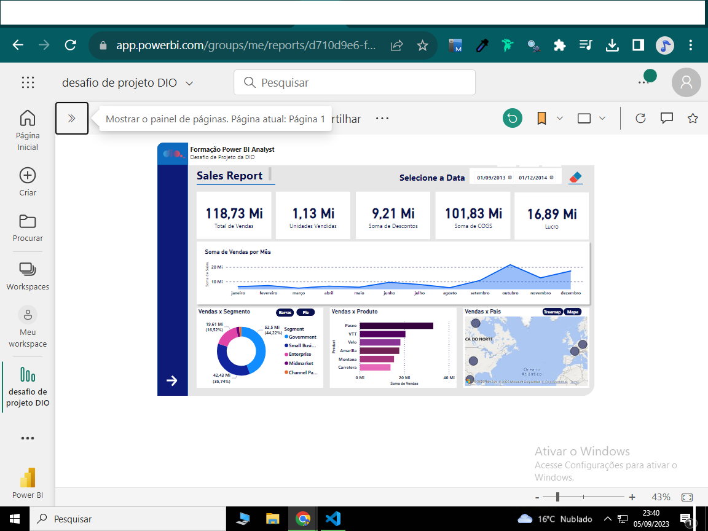
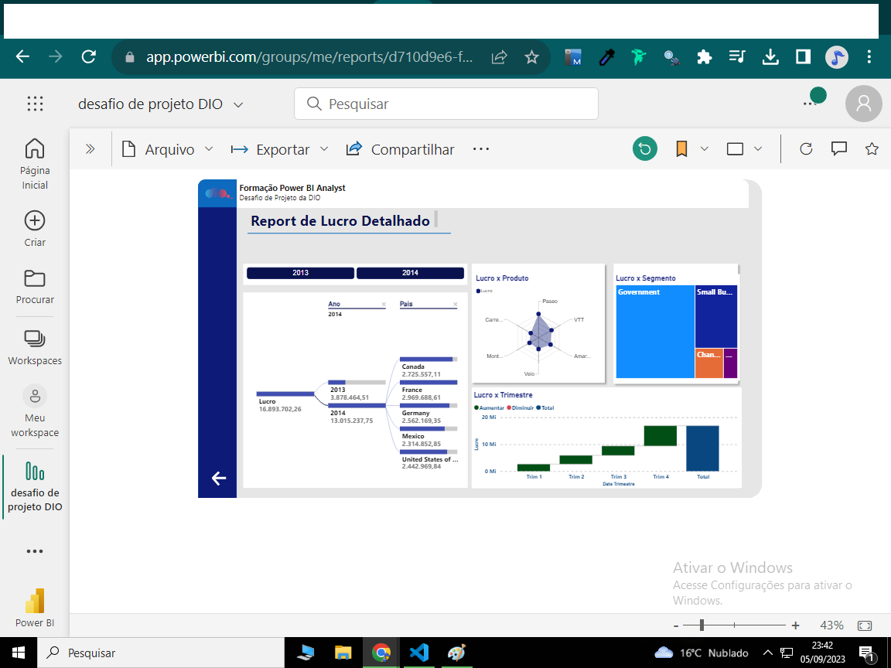

# Power BI

## Desafio de Projeto **POWER BI ANALYST**

### Neste desafio foi criado um relatório com graficos de barra, pizza, mapa e segmentadores.
### Botões de iteração e navegação por páginas.
### Os dados utilizados são da sample de vendas do próprio POWER BI.
### Foram analisados lucro, vendas, produtos mais vendidos por pais e outros...;

## Imagens do Relatório Postado no POWER BI SERVICE:

## Página 1

## Página 2

